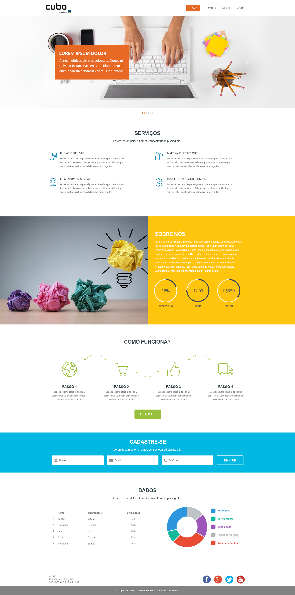

  

# < front >Developer</ end > ao Cubo

Objetivo deste desafio é avaliarmos o seu domínio em front-end, ou seja, sua organização, estilo e boas práticas com o código, conhecimento dos frameworks e tecnologias utilizadas.

## Regras

1. Todo o seu código deve ser disponibilizado num repositório **público** ou **privado** em seu Github ou Bitbucket pessoal. Envie o link para dev@cubo.network ou faça um pull-request;  
2. Desenvolver o projeto utilizando: 
  - HTML e CSS (ou algum pré-processador); 
  - Algum framework SPA (Atualmente estamos trabalhando com **Angular**, mas use o que achar melhor);
  - Layout responsivo;

## O Desafio

Este é o layout que deverá ser desenvolvido:

E aqui o PSD do layout:
[Download do arquivo](layout-onepage.psd)

### Dados Variáveis

Para montar a sessão **SOBRE NÓS** temos três gráficos de pizza na qual os dados devem ser obtidos através do método GET da API
https://of900lijd5.execute-api.us-east-1.amazonaws.com/v2/front-end/pie-chart

Para montar a sessão **DADOS** temos um grid e um gráfico de pizza na qual os dados devem ser obtidos através do método GET da API
https://of900lijd5.execute-api.us-east-1.amazonaws.com/v2/front-end/grid-people

### Algumas dicas e observações

> Obs 1.: Fique a vontade para utilizar qualquer 3rd party, seja para gráficos, testes, etc;

> Obs 2.: Abuse das animações, queremos ver seu domínio com CSS3;

> Obs 3.: Temos um formulário neste layout, considere que todos os campos são de preenchimento obrigatório e ao submeter o formulário os campos preenchidos devem ser exibidos no console (_console.log_).
 
## Dúvidas

Envie suas dúvidas diretamente para dev@cubo.network ou abrindo uma issue.
